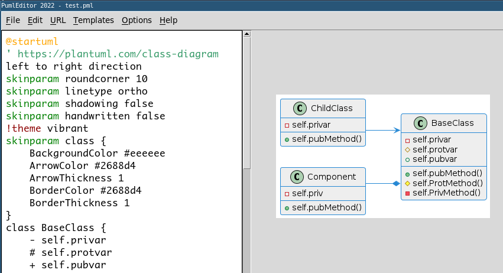

# README

Repository for the course Databases and Practical Programming at the University of Potsdam

The following applications will be added:

* mkdoc - create API documentation from Markdown
* kroki - encode diagram code as kroki URL's (done)
* sfa   - create single file applications from a few Python source code files
* SQLViewer - an SQLViewer application forSQLite databases
* [PumlEditor](docs/dbpp.peditor.PumlEditor.md) - an Diagram Editor with preview functionality started with `python -m dbpp.peditor (diagramfile)` (done)



The following libaries will be as well added:

* [dbpp.widgets](docs/dbpp.widgets.md) - collection of Tkinter-widgets to build applications (done)
* kroki - a class [KrokiEncoder](https://github.com/mittelmark/dbpp/blob/main/dbpp/kroki/KrokiEncoder.py)

# Installation

You can install this package using the following command:

```
$ pip3 install git+https://github.com/mittelmark/dbpp.git --user
$ # after successfull install try this
$ python3 -m dbpp.kroki
$ # which should give yo a message like 
$ I am kroki __main__.py
$ python3 -m dbpp.peditor # should start the PumlEditor
```

# dbpp.widgets

A Python package with the following Tkinter widgets 
([HTML documentation](http://htmlpreview.github.io/?https://github.com/mittelmark/dbpp/blob/master/docs/dbpp.widgets.html)):

- [GuiBaseClass](docs/dbpp.widgets.GuiBaseClass.md) - base class to build your own Tkinter applications
- [AutoScrollbar](docs/dbpp.widgets.AutoScrollbar.md) - a scrollbar which autohides if not required, easier to use is the [Scrolled](dbpp.widgets.Scrolled.md) method
- [Balloon](docs/dbpp.widgets.Balloon.md) - a tooltip widgets which can use balloon popups or existing label widgets
- [Ctext](docs/dbpp.widgets.Ctext.md) - a syntax highlighting widget based on Tcl tklib ctext widget
- [LabEntry](docs/dbpp.widgets.LabEntry.md) - a composite widget out of ttk.Label and ttk.Entry 
- [Scrolled](docs/dbpp.widgets.Scrolled.md) - a helper functions to attach scrollbars to widgets
- [SqlText](docs/dbpp.widgets.SqlText.md) - a Text widget with support for SQL highlighting based on Ctext
- [StatusBar](docs/dbpp.widgets.StatusBar.md) - a statusbar having a label for messages and a progressbar
- [TableView](docs/dbpp.widgets.TableView.md) - a ttk.Treeview widget optimized for tabular output
- [TextMixins](docs/dbpp.widgets.TextMixins.md) - small addons for the tk.Text widget such as font increasing shortcuts, right click popups and others
- [XTableView](docs/dbpp.widgets.XTableView.md) - an extended version of TableView which allows easily to read in list data
- [XTreeView](docs/dbpp.widgets.XTreeView.md) - a ttk.Treeview widget which provides icon facilities

# Running the application

## kroki

This a command line tool to encode diagram code such as [GraphViz](https://www.graphviz.org) (.dot), [PlantUML](https://www.plantuml.com) (.pml) or [Ditaa](https://github.com/stathissideris/ditaa) (.dit) files as image url's using the [kroki](https://kroki.io) webservice or backtranslates image url's into diagram code.

Here an example for a backtranslation of an url into diagram code:

```
$ python3 -m dbpp kroki https://kroki.io/plantuml/svg/eNpLzkksLlZwVKhWqAUAF10DsA==
class A { }
```
