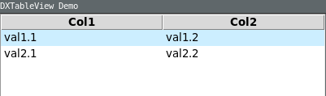

<center>

**[dbpp.widgets](dbpp.widgets.md) package:** 
[GuiBaseClass](dbpp.widgets.guibaseclass.md) -
[AutoScrollbar](dbpp.widgets.autoscrollbar.md) -
[Balloon](dbpp.widgets.balloon.md) -
[Ctext](dbpp.widgets.ctext.md) -
[LabEntry](dbpp.widgets.labentry.md) -
[RoText](dbpp.widgets.rotext.md) -
[Scrolled](dbpp.widgets.scrolled.md) -
[SqlText](dbpp.widgets.sqltext.md) -
[StatusBar](dbpp.widgets.statusbar.md) -
[TableView](dbpp.widgets.tableview.md) -
[TextMixins](dbpp.widgets.textmixins.md) -
[XTableView](dbpp.widgets.xtableview.md) -
[XTreeView](dbpp.widgets.xtreeview.md) 

[dbpp.kroki](dbpp.kroki.md) - 
[dbpp.kroki.KrokiEncoder](dbpp.kroki.krokiencoder.md) -
[dbpp.utils](dbpp.utils.md) - 
[dbpp.utils.SqlUtils](dbpp.utils.sqlutils.md)  -

**apps:** [dbpp.peditor](dbpp.peditor.pumleditor.md)


</center>

<!-- markdownlint-disable -->

<a href="../dbpp/widgets/XTableView.py#L0"></a>

# <kbd>module</kbd> `widgets.XTableView`
Extension of the TableView widget which can as well insert lists into the ttk.Treeview widget. 

The widget TableView provides an extension for the [TableView](TableView.html)  table widget with a readData function, getting header and lists  inheriting all methods and options from `TableView`. 

Hint: This functionality should be better implemented as a Mixin. 

Below you see the inheritance hierarchy and the added methods: 

```{.kroki echo=false dia=plantuml}
@startuml
class "ttk.TreeView" as Treeview {
     configure(kwargs)
     cget("property")
     etc()
}
class "dbpp.widgets.TableView" as TableView {
     readTabfile(filename)
     pack(kwargs)
     pack_forget()
}
class "dbpp.widgets.XTableView" as XTableView {
     insertData(colnames,data)
}
Treeview <- TableView
TableView <- XTableView
@enduml
``` 


**Examples:**
 

```
import tkinter as tk
import tkinter.ttk as ttk
from dbpp.widgets.XTableView import XTableView 
root = tk.Tk()
root.title('XTableView Demo')
dgtab=XTableView(root)
dgtab.insert_data(['Col1','Col2'],
     data=[['val1.1','val1.2'], ['val2.1','val2.2']])
root.geometry("400x300")
root.mainloop()
``` 

 

**Author:** Detlef Groth, University of Potsdam, 2019-2023 

**License:** MIT - License 


---

<a href="../dbpp/widgets/XTableView.py#L61"></a>

## <kbd>class</kbd> `XTableView`
Extended ttk.Treeview based on TableView. 

<a href="../dbpp/widgets/XTableView.py#L64"></a>

### <kbd>method</kbd> `__init__`

```python
__init__(parent, *args, **kwargs)
```

The constructor to create a XTableView widget. 


**Args:**
 
 - <b>`parent`</b> (ttk.Frame): the parent widget wherein the ttk.Treeview widget will be placed. 
 - <b>`*args (list)`</b>:  standard ttk.Treeview arguments which will be delegated to the widget 
 - <b>`**kwargs (dict)`</b>:  standard ttk.Treeview arguments which will be delegated to the widget 


**Returns:**
 XTableView widget with addtional methods and all methods of a ttk.Treeview widget 


---

<a href="../dbpp/widgets/XTableView.py#L78"></a>

### <kbd>method</kbd> `insert_data`

```python
insert_data(colnames='', data='')
```

Inserts data into a ttk.Treeview widget. 


**Args:**
 
 - <b>`colnames`</b> (list):  list of column nanes 
 - <b>`data`</b> (list):  nested list of data 


---

_This file was automatically generated via [lazydocs](https://github.com/ml-tooling/lazydocs)._
